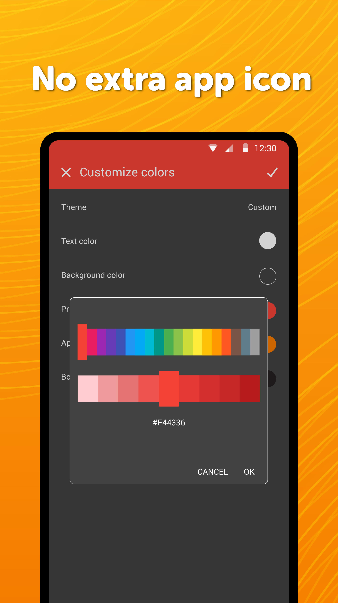

# Simple Thank You

If you like our apps which are free, non-intrusive and have no ads, please consider supporting us in some way. It will be hugely appreciated.

Having this app installed will prevent the displaying of a "Donate please" dialog in the free apps. Other than that, it also allows using a Shared Theme, which means that as soon as you change a color in one app, all other apps will be updated. Newly installed apps from the suite will automagically receive the shared colors too.

It might unlock more extra features in the future. Please keep the app installed at least for a day, to avoid getting automatically refunded.

This app is not a replacement for the Pro app versions. You will still have to purchase them separately, in case you want to use them.

Contains no ads or unnecessary permissions. It is fully opensource, provides customizable colors.

Check out the full suite of Simple Tools here:  
https://www.simplemobiletools.com

Facebook:  
https://www.facebook.com/simplemobiletools

Reddit:  
https://www.reddit.com/r/SimpleMobileTools

